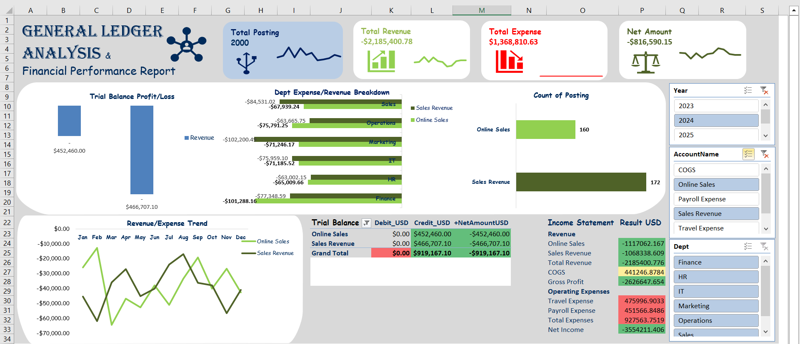
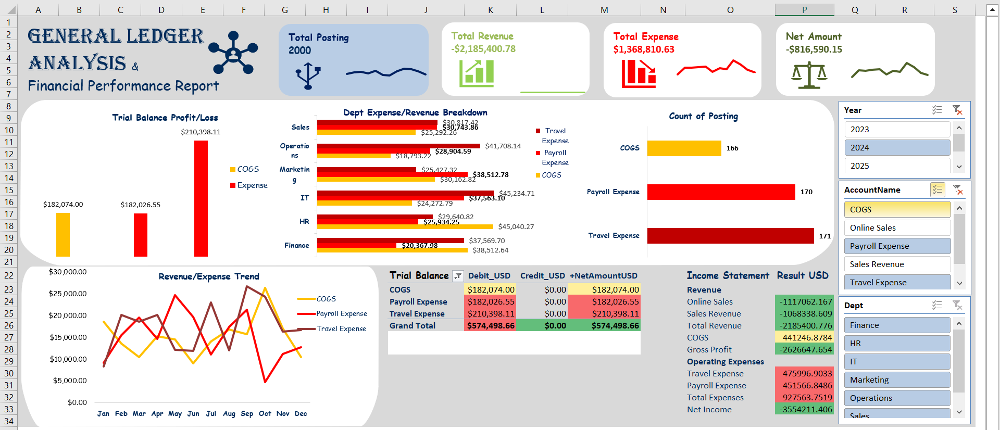
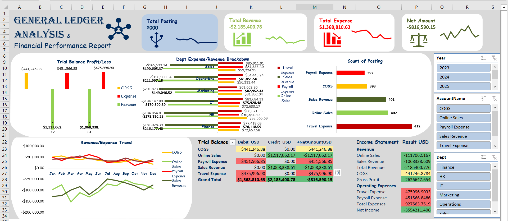

# 📊 General Ledger Financial Analysis

## 📌 Project Overview  
This project demonstrates how to transform a General Ledger dataset (2,000 Records) into meaningful financial reports and KPIs using only Excel and Power Query.  

The dataset includes Revenue, COGS, and Expense accounts, along with Department, Cost Center, and Multi-Currency codes.  
The goal was to replicate real-world financial reporting by building:  

- Trial Balance  
- Profit & Loss Statement (P&L)  
- Department & Cost Analysis  
- Multi-Currency Reporting  
- KPI Dashboard  

---

## 📂 Repository Structure


---

## 📊 Business Questions Answered  

1. **Trial Balance – Are Debits and Credits balanced?**  
   - Used =SUM(Debit) – SUM(Credit) check, reviwed using pivotTable drill-down. 
   - Found imbalance: -763,041.46 (base currency) and -816,590.15 USD (after conversion).
   - ``=SUM(Debit) - SUM(Credit)``

2. **P&L Statement – What is Net Profit by month/year?**  
   - Built with SUMIFS for Revenue, COGS, and Expenses.  
   - Net Profit = Revenue – Expenses.
   - Gross Profit = Total Revenue - COGS
   - NetProfitUSD ```=(SUMIFS(H:H,B:B,"Online Sales")+SUMIFS(H:H,B:B,"Sales Revenue"))
-(SUMIFS(H:H,B:B,"COGS")+SUMIFS(H:H,B:B,"Travel Expense")+SUMIFS(H:H,B:B,"Payroll Expense"))```

3. **Department Analysis – Which department incurs the highest expenses?**  
   - PivotTable grouped by Department.  
   - Travel expense was consistently the largest.   

4. **Multi-Currency – How do exchange rate fluctuations affect reporting?**  
   - Created an Exchange Rate table in Excel.  
   - Added NetAmountUSD column via Power Query merge.
   - Used INDEX MATCH to verify ``=INDEX(ExchangeRate[Rate2USD], MATCH(GL!L:L,ExchangeRate[Currency], 0))``  
   - Compared results with and without conversion.  

5. **Revenue/Expense Trend – How has Sales Revenue grown across months/years?**  
   - PivotChart with Month on axis + Year as slicer.
   - Visualized with a lines chart
    REVENUE
    EXPENSE

7. **Transaction Analysis – Which accounts have the highest number of postings?** 
   - Used COUNTIFS by AccountName.  
   - Sales Revenue had the most activity.
   - Drill-down of count of posting visualized.

---

## 🛠️ Tools & Techniques  

- Excel  
  - Power Query → data cleaning, currency conversion & merging ExchangeRate table. 
  - PivotTables & PivotCharts → reporting & analysis  
  - Formulas:  
    - SUMIFS, COUNTIFS → financial aggregation and grouping 
    - INDEX-MATCH, VLOOKUP → currency lookups  
    - IF, IFS, TRIM, TODAY → data validation & cleaning  

- Visualization & Dashboarding  
  - KPI Cards: *Total Revenue, Total Expenses, Net Profit, Number of Posting*  
  - Revenue Trend (line chart with slicer)  
  - Department Expense Breakdown (bar chart)  
  - Trial Balance Check (table balanced/unbalanced flag)
  - Income statement
  - year, accountname & department slizers
   DASHBOARD

---

## 📌 Key Insights  

- Ledger was out of balance by -816K USD (post conversion).  
- Travel expense was the largest expense category across departments.  
- Revenue trend analysis highlighted periods of growth/decline.  
- Imbalance trial balance, both Debit & Credit were filled — indicating possible data entry issues.  

---

## ⚡ How to Reproduce  

1. Open General-Ledger.xlsx.  
2. Load data into Power Query → add exchange rates → create NetAmountUSD.  
3. Use PivotTables to generate:  
   - Trial Balance  
   - P&L  
   - Department Expense/Revenue Analysis  
   - Revenue Trends  
4. Add formulas for Net balance, Gross profit
5. Assemble into a clean Dashboard.xlsx with slicers for interactivity.  

---

## 📌 Learning Outcomes  

This project demonstrates how Excel is still powerful enough to handle real-world financial analysis workflows that are often done in ERP/BI systems.  

- Built an end-to-end reporting pipeline with just Excel.  
- Showcased finance + analytics crossover skills.  
- Practiced advanced Excel: Power Query, PivotTables, complex formulas.  

---
